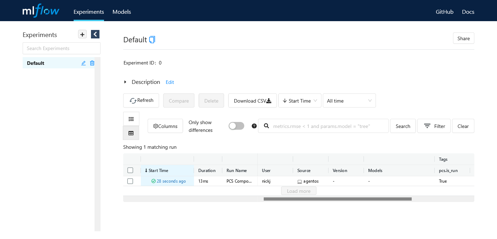
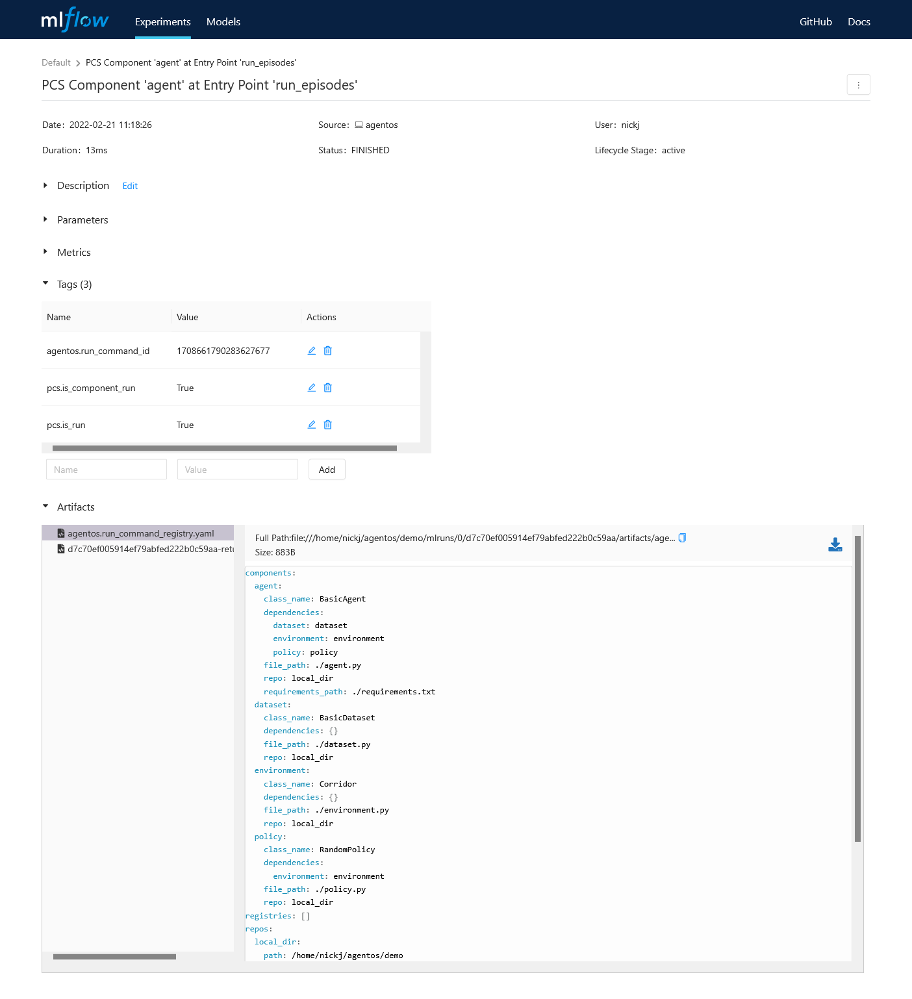
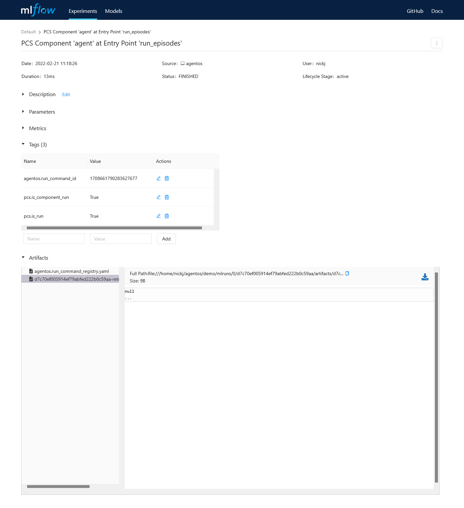

***********************************
Local Development Quick Start
***********************************

The Python Component System (PCS) can also be used within a project you're
developing in your local development environment.  

In this quickstart, we'll work through an example of using PCS in a local
project.  We'll start by installing ``agentos``. Run the following in your
shell::

    pip install agentos

Now, let's create a new directory for our project and initialize it.  Run the
following in your shell::

    agentos init quickstart
    cd quickstart

The ``agentos init .`` command creates (in the current directory) a default
project that illustrates the usage of PCS in a local development context.  You
will notice that your directory now contains a ``components.yaml`` file along
with a number of Python files.

If you inspect ``components.yaml``, you will see a human-readable registry of
the different Python classes (found in the newly created Python files) that
this project uses.  These classes are referred to as **Components** in PCS and
they provide the foundation of any project built to execute in the PCS runtime.

The default project creates an agent that walks down a 1-dimensional corridor by
randomly choosing to step left or right.  Let's try to run our default
project::

    agentos run agent

This command runs the default entry point of the ``agent`` Component as
defined in ``components.yaml``.  If everything is successful, you will see
output reporting how many steps your agent took to walk down the whole
corridor.

Tracking and Reproducibility
----------------------------

Now that we have executed our program, we can do a crash course in the the
tracking and reproducibility facilities provided by PCS.  Run the MLflow UI in
your shell and navigate to `localhost:5000 <http://localhost:5000>`_::

    mlflow ui

You will notice that a run was created when you executed the ``agentos run
agent`` command.

.. _fig_pcs_ui_4:

  The MLflow experiment tracking page.

This run records sufficient information to reproduce the execution of your
programs.  If you navigate into the run detail page, you will notice two
artifacts associated with the run: a registry file and a results file.

.. _fig_pcs_ui_5:

  A registry and a results file are associated with your run.  The registry
  file records the information required to reproduce your run.

The registry file records information about the Components instantiated, the
command executed, the parameters passed to generate the run.  If shared with
others, this file is sufficient to allow reproduction of your run.

The second file, the results file, records information about the return value
of the run.

.. _fig_pcs_ui_6:

  The result file records information about the return value of your run.

Extending Our Agent
-------------------

PCS is designed to make it easy to modularize your projects at the class
level.  We will now use PCS to add a new Component to our corridor-walking
agent.

Our new Component will simply print an update to stdout whenever our agent
walks left or right.  First let's create our new Component.  Create the file
``movement_updater.py`` in your agent directory and add the following code to
it::

    class MovementUpdater:
        def update(self, action):
            move_name = "left" if action == 0 else "right"
            print(f"I just moved {move_name}")

Now let's add this new Component to our registry file, open
``components.yaml`` and add the following entry for our Component under the
``components`` key::

    movement_updater:
        repo: local_dir
        file_path: ./movement_updater.py
        class_name: MovementUpdater

Now let's update our ``agent`` Component to depend on the ``MovementUpdater``.
Still in ``components.yaml``, update the ``dependencies`` entry of the
``agent`` Component to include ``movement_updater``.  Afterward, the entry
should look as follows::

    agent:
        repo: local_dir
        file_path: ./agent.py
        class_name: BasicAgent
        requirements_path: ./requirements.txt
        dependencies:
            environment: environment
            policy: policy
            dataset: dataset
            movement_updater: movement_updater

Now, finally, in our agent class, let's make use of the movement updater.
Let's open ``agent.py`` and update the ``run_episode()`` method to make use of
the ``movement_updater``.  We'll add a call to ``movement_updater.update()``
after each time the agent takes a step in the environment.  Update the
``run_episode()`` method as follows::

    def run_episode(self):
        curr_obs = self.environment.reset()
        done = False
        transitions = []
        while not done:
            action = self.policy.decide(curr_obs)
            new_obs, reward, done, info = self.environment.step(action)
            self.movement_updater.update(action)
            transitions.append((curr_obs, action, new_obs, reward, done))
            curr_obs = new_obs
        self.dataset.add(transitions)

Notice that PCS automatically initializes an instance of the
``MovementUpdater`` class and adds it as a member to the ``Agent`` class.  We
can now run our agent again to ensure our ``MovementUpdater`` Component is
functioning as expected.  On the command-line, run::

    agentos run agent

and you should see output that looks like::

    ...
    I just moved right
    I just moved right
    I just moved left
    I just moved left
    I just moved right
    I just moved right
    I just moved left
    I just moved right
    I just moved right
    
    Results after 1 episodes
    ...

Great!  It looks like our ``MovementUpdater`` Component is working as we
expected.  Because we created ``MovementUpdater`` as a Component, PCS is able
to track parameters and dependencies of the Component for reproducibility
purposes.  Additionally, this Component can be published individually and used
in other projects separate from the rest of the Components that constitute our
agent.

# TODO: sharing
