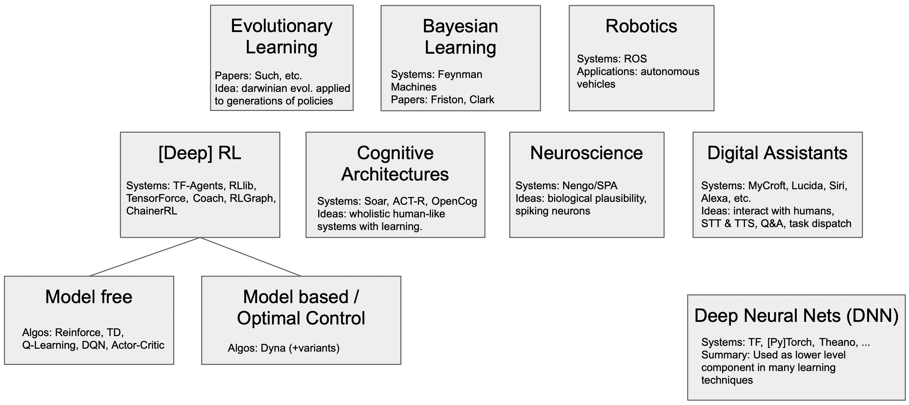

**********
Motivation
**********
.. _Ray RLlib: https://docs.ray.io/en/master/rllib.html
.. _Soar: https://soar.eecs.umich.edu
.. _Nengo: https://www.nengo.ai
.. _MyCroft: https://github.com/MycroftAI/mycroft-core
.. _Berkeley CS285 RL Course: https://github.com/berkeleydeeprlcourse/homework_fall2019/tree/master/hw1/cs285
.. _Tensorflow Agents: https://www.tensorflow.org/agents
.. _TensorForce: https://github.com/tensorforce/tensorforce

Many researchers and developers across reinforcement learning, robotics, AI, NLP, neuroscience, machine learning, cognitive science, psychology, business build learning agents (for example, `Ray RLlib`_, Nengo_, Soar_, `ACT-R <http://act-r.psy.cmu.edu>`_, `ROS <https://www.ros.org/>`_, MyCroft_, `Google Assistant <https://assistant.google.com>`_, `Apple's Siri <https://www.apple.com/siri/>`_).

  The learning agent landscape. Each box represents a different discipline or area where learning agents are used.

Typically, agents...

  * interact with the world via observe -> decide -> act loops
  * have goals or intentions, e.g., to maximize a reward signal
  * are driven by complex inner state, which may include a model of their environment, the value of past actions, or memories of past interactions with the environment

While there exist open source APIs and implementations for Environments (e.g., OpenAI `gym.Env <https://github.com/openai/gym/blob/master/gym/core.py>`_) and learning algorithms (e.g. `Ray RLlib`_, `TensorFlow Agents`_), there has not emerged a de facto standard set of APIs and tools for composing, running, and managing long running learning agents.

Thus, each researcher or developer designs and implements their own agent architecture, including how the agent interacts with an environment, organizes trials (or “rollouts”) used for learning, stores memories in some format, uses experience for learning, etc. (e.g., `Berkeley CS285 RL Course`_, Soar_, ROS_, Mycroft_).

To rapidly build new agents, it should be easy to focus on one new sub-system and not have to re-create all of the other necessary functionality from scratch.

It should also be easy to upgrade an agent so that it starts using a learning algorithm released/maintained by somebody else, similar to how we can upgrade an application or an operating system component like a file system.

However, most existing systems that support agent development are monolithic and do not provide standard interoperable components. For example, OpenAI Baselines algorithms cannot easily be plugged into a Ray Trainer or an instance of MyCroft; neither can a memory module from ACT-R be easily plugged into Soar, EPIC, OpenCog, or any other cognitive architecture or agent architecture.

In contrast, the popular RL ``gym.Env`` API built by OpenAI is simple, accessible, and RL classes (e.g., `Berkeley CS285 RL Course`_) and RL frameworks (`Ray RLlib`_, `Tensorflow Agents`_, `TensorForce`_) are using it as a standard.

We would like to see a similar standardization happen for the structure of a learning Agent itself, and related common components (e.g., behavior policy, memory). We hope that the AgentOS ``Agent`` and related abstractions -- with their simplistic and modular design -- might inspire new open source de facto standards that accelerate building and researching learning agents.

Finally, we hope that progress towards more general agent behavior might be accelerated by focusing on agents composed of a combination of RL algorithms and learning techniques (perhaps many sub-agents arranged hierarchically) interacting concurrently with many environments (virtual sensors and actuators, and their underlying directly unavailable state), just as humans do. We aim to facilitate and demonstrate this in agents we build using AgentOS.

In summary, AgentOS aims to make it easy to build and work with agents and their environments. This includes composing agents from common components, and building such components using simple minimalistic APIs. AgentOS does this in a modern way, building on---and interoperating with---existing popular languages, libraries, tools, and frameworks including Python, pip/PyPI, Conda, Git, and MLflow.

