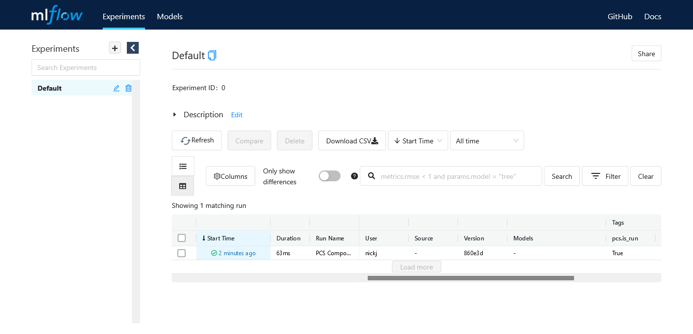
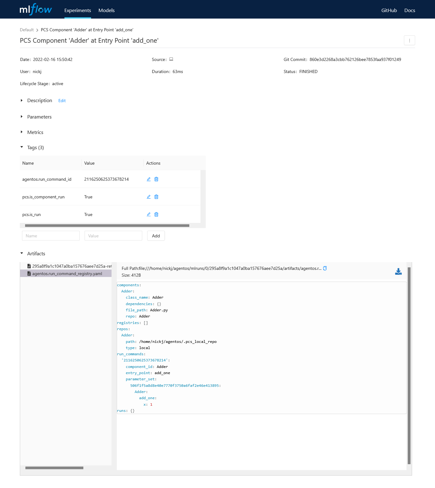
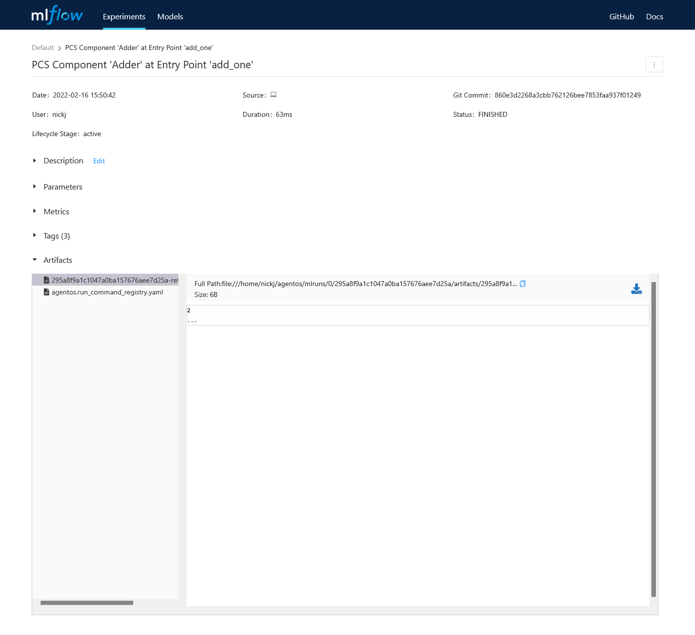

***********************************
Python REPL Quick Start
***********************************

The Python Component System (PCS) is a **command line interface and Python
developer API** for building, running, and sharing Python programs.

In this quickstart, we'll introduce PCS by using it directly in the Python
REPL, so let’s install it and write a simple program. Installation is easy,
run the following in your shell::

  pip install agentos

Writing a trivial program that takes advantage of PCS is also easy.  First,
open the Python REPL by running the following in your shell::

  python

Now we'll define a very basic class and then we'll use PCS to track the
execution of a method on this class and share the results::

  >>> class Adder:
  ...   def add_one(self, x):
  ...     return x + 1
  ...

Now let's import one of the core PCS abstractions: **Component**.  A Component
wraps a Python class and provides facilities for tracking and sharing.  Let's
wrap our ``Adder`` class in a Component now::

  >>> from pcs import Component
  >>> adder_component = Component.from_class(Adder)

Now we'll run our ``Adder.add_one()`` function in a reproducible and shareable
way with PCS::

  >>> adder_component.run('add_one', {'Adder':{'add_one':{'x':1}}})

That's it!  Using the ``run`` method on our Component automatically instruments
our call to ``Adder.add_one`` and tracks its inputs and outputs so we can
easily share and reproduce this program execution.

Let's take a look at what we've recorded about our program execution.  Exit
the Python REPL and then run the following::

  mlflow ui

Now navigate to `http://127.0.0.1:5000 <http://127.0.0.1:5000>`_ to see the
results of our program execution.  First you'll land on your local `MLflow
<https://mlflow.org>`_ experiment tracking page (PCS uses MLflow under the hood
for experiment tracking):

.. _fig_pcs_ui_1:

  The MLflow experiment tracking page.

As you can see, we've recorded one run (our call to ``Adder.add_one()``).
Click the link into the run and you'll see that we've recorded information
about the inputs and command we ran:

.. _fig_pcs_ui_2:

  The command we ran to execute our program.

As well as the results from our execution:

.. _fig_pcs_ui_3:

  The results of our program execution.

While our ``Adder.add_one()`` example was very simple, tracking commands and
arguments can get complex as your program grows.  PCS is designed to manage
this complexity in a straightforward and consistent way.

# TODO: sharing
